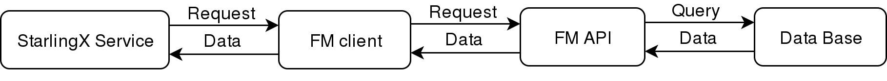

=======================
stx-fault Documentation
=======================

Following is the documentation for StarlingX fault management.

--------
Overview
--------

Fault management is a component of StarlingX project that detects, classifies,
and notifies different behaviors occurring in the infrastructure.

Undesirable behaviors in the system are detected as alarms that usually need
corrective actions intermediately. The severity is determined according to a
classification (e.g. critical, warning, and others) that provide the operator
with more information about the system's condition. The classification also
provides which system component is affected (e.g. network, storage, security,
and so forth).

Additionally, fault management (FM) handles expected behaviors organized in
events. These behaviors are classified and show relevant information for the
administrator that might require an action. Fault Management is a useful
service to monitor the infrastructure's health and allows you to action
according to priorities.

Fault management is comprised of a group of sub-projects that work together to
offer the FM service. Following is a brief description of FM's role:

+-----------------+-----------------------------------------------------------+
| Sub-project     | Description                                               |
+=================+===========================================================+
| fm-api          | Application API used by software applications to raise,   |
|                 | clear and audit the alarms and events.                    |
+-----------------+-----------------------------------------------------------+
| fm-common       | Includes libraries used by the fm-mgr. Additionally,      |
|                 | fm-mgr includes a client that interacts with fm-mgr       |
|                 | throughout  a socket.                                     |
+-----------------+-----------------------------------------------------------+
| fm-mgr          | Creates, reads, and deletes faults. fm-mgr can access the |
|                 | database.                                                 |
+-----------------+-----------------------------------------------------------+
| fm-rest-api     | Through use of a RESTful API, allows information on events|
|                 | and alarms from the database to be reported. For more     |
|                 | information, see the API reference.                       |
+-----------------+-----------------------------------------------------------+
| python-fmclient | Allows use of the Fault Management RESTful API.           |
+-----------------+-----------------------------------------------------------+

StarlingX services can use Fault Management through a client that at the same
time uses the API to handle the information in the database. The following
diagram describes the process:

   *Fault Management usage flow*

Finally, the StarlingX dashboard includes a view/panel that allows you to more
easily view and interpret FM operations.

-------------
Release Notes
-------------

.. toctree::
   :maxdepth: 1

   Release Notes <https://docs.starlingx.io/releasenotes/stx-fault>

-------------
API Reference
-------------

.. toctree::
   :maxdepth: 1

   API Reference <https://docs.starlingx.io/api-ref/stx-fault>

-----
Links
-----

* Source: `stx-fault`_
* Code Review: `Gerrit`_
* Bugs: `Storyboard`_

.. _stx-fault: https://opendev.org/starlingx/fault
.. _Gerrit: https://review.opendev.org/#/q/project:starlingx/fault
.. _Storyboard: https://storyboard.openstack.org/#!/project/starlingx/fault
